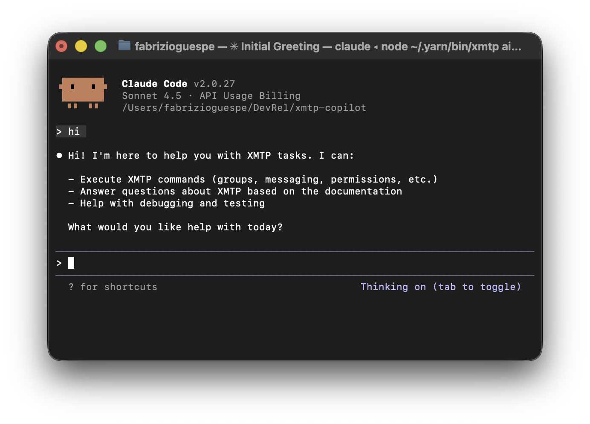

# XMTP Copilot



A powerful XMTP copilot that provides CLI commands and Slack bot integration for XMTP protocol testing and management.

## Usage

After installation, use the `xmtp` command from anywhere:

```bash
# Start Claude Code AI assistant
xmtp ai

# Start XMTP channels
xmtp start              # Both XMTP and Slack channels
xmtp xmtp               # XMTP channel only
xmtp slack              # Slack channel only

# Quick command examples
xmtp groups --members 5 --name "My Group"
xmtp send --target 0x1234... --message "Hello!"
xmtp debug info
xmtp permissions list --group-id <group-id>
xmtp list

# Get help
xmtp --help
xmtp <command> --help
```

## Development

### Prerequisites

- Node.js (>20.18.0)
- Yarn 4.6.0
- XMTP environment access

### Installation

```bash
# Clone the repository
git clone https://github.com/your-org/xmtp-copilot
cd xmtp-copilot

# Install dependencies
yarn install

# Link globally to use 'xmtp' command anywhere
yarn link

# Add yarn global bin to your PATH (if not already added)
echo 'export PATH="$HOME/.yarn/bin:$PATH"' >> ~/.zshrc
source ~/.zshrc
```

### Environment variables

Create a `.env` file in the project root:

```bash
XMTP_ENV= dev # local, dev, production

# public key is 0x3de2787073732369f2e984ca5b981feCbF0f7FC5
ANTHROPIC_API_KEY=


# Pinata API Key
PINATA_API_KEY=
PINATA_SECRET_KEY=
# keys for xmtp-attachments

# keys for xmtp-code
XMTP_WALLET_KEY=
XMTP_DB_ENCRYPTION_KEY=
# public key is 0x3FaA46B76dBD83117d17c190e69a9147F98edB3D

SLACK_BOT_TOKEN=
SLACK_APP_TOKEN=
SLACK_SIGNING_SECRET=
```
