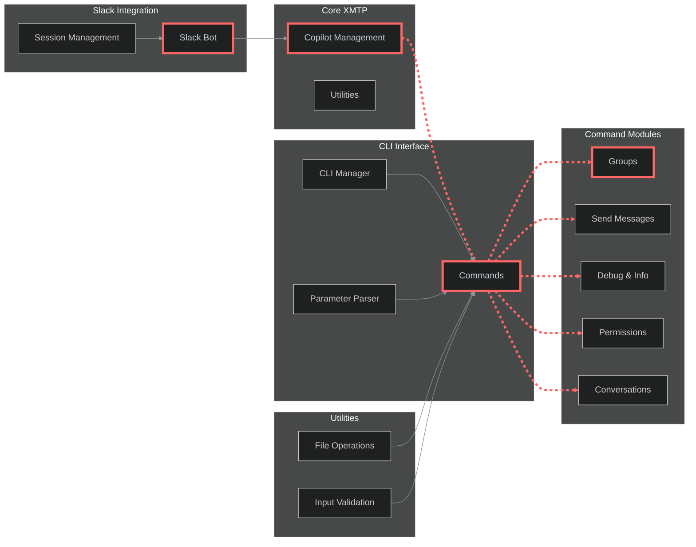

# XMTP Copilot

A powerful XMTP copilot that provides CLI commands and Slack bot integration for XMTP protocol testing and management.

## Architecture

This flowchart illustrates the XMTP Copilot's modular architecture and integration points:



> The highlighted path (red dashed line) shows the main command execution flow from CLI to XMTP operations.

The XMTP Copilot provides a comprehensive interface for XMTP protocol operations through both CLI and Slack bot interfaces. The architecture is designed with modularity in mind, allowing for easy extension and maintenance.

#### Core functionality

- **CLI Interface**: Command-line operations for XMTP protocol testing
- **Slack Integration**: Interactive bot for real-time XMTP operations with Claude CLI
- **XMTP Channel**: Message relay through Claude CLI for AI-powered responses
- **Group Management**: Create and manage XMTP groups and conversations
- **Message Operations**: Send messages, debug information, and manage permissions
- **Session Management**: Maintain conversation context across both channels

## Documentation

- Commands: CLI command reference and usage - see [section](./docs/CLAUDE.md)
- Architecture: Project structure and design patterns - see [section](#architecture)
- Development: Setup and development guidelines - see [section](#development)

## Tools & utilities

- CLI: Command line interface for XMTP operations - see [section](#available-commands)
- Slack Bot: Interactive Slack integration - see [section](#slack-integration)
- Debug: Debug and information gathering tools - see [section](#debug--information)
- Groups: Group management and operations - see [section](#groups-management)
- Permissions: Permission management and updates - see [section](#permissions-management)

## Development

#### Prerequisites

- Node.js (>20.18.0)
- Yarn 4.6.0
- XMTP environment access

#### Installation

```bash
# Clone the repository
git clone https://github.com/your-org/xmtp-copilot
cd xmtp-copilot

# Install dependencies
yarn install

# Generate XMTP keys
yarn gen:keys
```

#### Environment variables

```bash
XMTP_WALLET_KEY=your_wallet_key
XMTP_ENCRYPTION_KEY=your_encryption_key
XMTP_ENV=dev
SLACK_BOT_TOKEN=your_slack_bot_token
SLACK_SIGNING_SECRET=your_slack_signing_secret
```

### Running the application

To get started, set up the environment variables and run the application:

```bash
# Run both XMTP and Slack channels simultaneously (recommended)
yarn dev:channels

# Or run channels individually:
yarn dev:xmtp    # XMTP channel listener only
yarn dev:slack   # Slack bot only

# Run CLI commands (one-off operations):
yarn groups
yarn send --target 0x1234... --message "Hello!"
```

#### Debug mode

```bash
# Run with debug logging
yarn start --debug

# Run CLI with verbose output
yarn groups --verbose
```

## Available Commands

### Groups Management

```bash
# Create a DM (default behavior)
yarn groups

# Create a group with multiple members
yarn groups --members 5 --name "My Group"

# Create group by Ethereum addresses
yarn groups create-by-address --name "Address Group" --member-addresses "0x123...,0x456..."
```

### Send Messages

```bash
# Send single message to target
yarn send --target 0x1234... --message "Hello!"

# Send multiple messages for testing
yarn send --target 0x1234... --users 10

# Send message to group
yarn send --group-id abc123... --message "Hello group!"
```

### Debug & Information

```bash
# Get general system information
yarn debug info

# Get address information
yarn debug address --address 0xe089d4e01a5cd0af7c119abce22b7828851cd387

# Get inbox information
yarn debug inbox --inbox-id 743f3805fa9daaf879103bc26a2e79bb53db688088259c23cf18dcf1ea2aee64

# Get installation information
yarn debug installations --inbox-id 743f3805fa9daaf879103bc26a2e79bb53db688088259c23cf18dcf1ea2aee64
```

### Permissions Management

```bash
# List group members and permissions
yarn permissions list --group-id <group-id>

# Update group permissions
yarn permissions update-permissions --group-id <group-id> --features add-member,remove-member --permissions admin-only
```

### Conversations

```bash
# List conversations
yarn conversations list

# Get conversation details
yarn conversations get --conversation-id <conversation-id>
```

## Slack Integration

The Slack bot provides an interactive interface for all XMTP operations:

- **Interactive commands** - Use natural language to interact with XMTP
- **Session management** - Maintains context across conversations
- **Real-time responses** - Get instant feedback on operations
- **Error handling** - Graceful error handling with helpful messages

Start the Slack bot with:

```bash
yarn start
```
