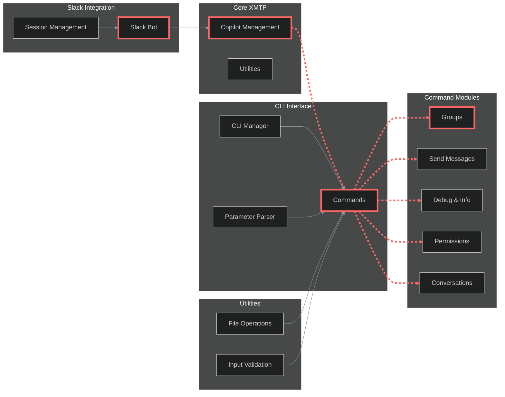

# XMTP Copilot

A powerful XMTP copilot that provides CLI commands and Slack bot integration for XMTP protocol testing and management.

## Architecture

This flowchart illustrates the XMTP Copilot's modular architecture and integration points:



> The highlighted path (red dashed line) shows the main command execution flow from CLI to XMTP operations.

The XMTP Copilot provides a comprehensive interface for XMTP protocol operations through both CLI and Slack bot interfaces. The architecture is designed with modularity in mind, allowing for easy extension and maintenance.

#### Core functionality

- **CLI Interface**: Command-line operations for XMTP protocol testing
- **Slack Integration**: Interactive bot for real-time XMTP operations with Claude CLI
- **XMTP Channel**: Message relay through Claude CLI for AI-powered responses
- **Group Management**: Create and manage XMTP groups and conversations
- **Message Operations**: Send messages, debug information, and manage permissions
- **Session Management**: Maintain conversation context across both channels

## Documentation

- Commands: CLI command reference and usage - see [section](./docs/CLAUDE.md)
- Architecture: Project structure and design patterns - see [section](#architecture)
- Development: Setup and development guidelines - see [section](#development)

## Tools & utilities

- CLI: Command line interface for XMTP operations - see [section](#available-commands)
- Slack Bot: Interactive Slack integration - see [section](#slack-integration)
- Debug: Debug and information gathering tools - see [section](#debug--information)
- Groups: Group management and operations - see [section](#groups-management)
- Permissions: Permission management and updates - see [section](#permissions-management)

## Development

#### Prerequisites

- Node.js (>20.18.0)
- Yarn 4.6.0
- XMTP environment access

#### Installation

```bash
# Clone the repository
git clone https://github.com/your-org/xmtp-copilot
cd xmtp-copilot

# Install dependencies
yarn install

# Link globally to use 'xmtp' command anywhere
yarn link

# Add yarn global bin to your PATH (if not already added)
echo 'export PATH="$HOME/.yarn/bin:$PATH"' >> ~/.zshrc
source ~/.zshrc
```

#### Environment variables

Create a `.env` file in the project root:

```bash
XMTP_WALLET_KEY=your_wallet_key
XMTP_ENCRYPTION_KEY=your_encryption_key
XMTP_ENV=dev
SLACK_BOT_TOKEN=your_slack_bot_token
SLACK_SIGNING_SECRET=your_slack_signing_secret
```

## Usage

### Global CLI Commands

After installation, use the `xmtp` command from anywhere:

```bash
# Start Claude Code AI assistant
xmtp ai

# Start XMTP channels
xmtp start              # Both XMTP and Slack channels
xmtp xmtp               # XMTP channel only
xmtp slack              # Slack channel only

# Quick command examples
xmtp groups --members 5 --name "My Group"
xmtp send --target 0x1234... --message "Hello!"
xmtp debug info
xmtp permissions list --group-id <group-id>
xmtp list

# Get help
xmtp --help
xmtp <command> --help
```

### Available Commands

- **`ai`** - Launch Claude Code AI assistant
- **`start`** - Start both XMTP and Slack channels
- **`groups`** - Create and manage XMTP groups/DMs
- **`send`** - Send messages to conversations
- **`debug`** - System information and debugging
- **`permissions`** - Manage group permissions
- **`list`** - List conversations
- **`content`** - Content type operations
